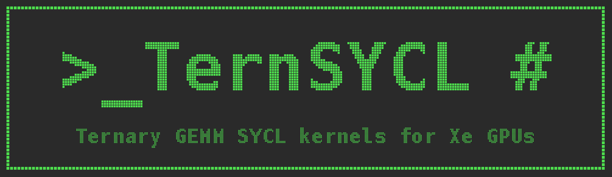

<p align="center">
  
</p>

# TernSYCL

Standalone SYCL kernels for ternary (2-bit, `{-1, 0, +1}` x per-group scale)
weight GEMM/GEMV on Intel Xe2 GPUs (Arc Pro B70 / BMG, Arc 140V / Lunar Lake).
TernSYCL is the SYCL counterpart of [TernOCL](https://github.com/libxsmm/TernOCL):
same kernels, data layouts, numerics, fused epilogues, drivers and benchmark
methodology, benchmarked against the TernOCL kernels on identical inputs.

| variant | math | activations | TernOCL counterpart |
| --- | --- | --- | --- |
| [int2_fp16_upcvt](int2_fp16_upcvt/) | int2 weights upconverted to fp16/bf16, fp16/bf16 DPAS, fp32 acc | fp16 or bf16 | `int2_fp16_upcvt.cl` |
| [int2_via_int2_x_int8_dpas](int2_via_int2_x_int8_dpas/) | activations quantized to int8 (per row and 128-group), native s8 x s2 DPAS, int32 acc | fp16 or bf16 | `int2_int8_dpas.cl` |
| [hadamard](hadamard/) | fused sign flip + blockwise 1024 Walsh-Hadamard input transform (Bonsai 2) | fp16 or bf16 | `hadamard_fwht.cl` |
| [bitcos_fp16_upcvt](bitcos_fp16_upcvt/) | BITCOS ternary weights (presence bitmap + compacted signs, `2 - z` bits/weight) decoded through an SLM table to fp16/bf16, fp16/bf16 DPAS, fp32 acc | fp16 or bf16 | `bitcos_fp16_upcvt.cl` |

The GEMM variants have a decode GEMV (M = 1..8) and a large-M GEMM (prefill),
and handle any M (ragged tiles are zero-filled on read and clipped on write).
They need `N % 16 == 0` and `K % 128 == 0`, with scale group size 128 (BITCOS
GEMV: `K % (64 * LS) == 0`).

## How the kernels are written

Plain SIMT SYCL (sub-group size 16), using the same IGC builtins as the OpenCL
kernels, declared in [common/xe2.hpp](common/xe2.hpp):

* DPAS: `intel_sub_group_{f16_f16,bf16_bf16}_matrix_mad_k16`,
  `intel_sub_group_i8_i2_matrix_mad_k32` (OpenCL mangling, resolved by IGC).
* 2D block I/O: `__builtin_IB_subgroup_block_read_flat_*` / `..._write_flat_*`.
* Sub-group block reads: `intel_sub_group_block_read{,4,_us,_us4,_us8}`.
* The int8 large-M kernel quantizes A with XeTLA's instruction sequence as
  inline vISA, as in TernOCL; the BITCOS kernels apply the fp16 scale with
  XeTLA's two SIMD32 `hf` multiplies as inline vISA (`--int-apply` and
  `--simt-mul` select the alternatives, bf16 always uses the integer AND).
* 256 GRF (large-M kernels) via the `grf_size<256>` kernel property; required
  sub-group and work-group sizes via kernel properties.

Tile parameters are template parameters. Each driver compiles a table of tiles
(`--list-tiles`, one device image per kernel with
`-fsycl-device-code-split=per_kernel`) and picks one at run time, so a tile
sweep needs no rebuild, as with the OpenCL `-D` build. The fused epilogue is a
uniform kernel argument, except in the int8 large-M kernel, where it is a
template parameter (a runtime epilogue costs about 3% there).

An ESIMD version of the int8 large-M kernel was tried and was slower than the
SIMT one; it is not part of the repo.

## Layout

```
common/            xe2.hpp (Xe2 builtins, 2D surfaces, dtype conversion), epilogue_dev.hpp (device
                   epilogues), epilogue.hpp / dt16.hpp (host epilogue, fp16/bf16, compare), driver.hpp
int2_fp16_upcvt/   kernels (int2_fp16_upcvt.hpp), driver, Makefile, validate.sh, bench.sh
int2_via_int2_x_int8_dpas/
                   kernels (int2_int8_dpas.hpp), driver, Makefile, validate.sh, bench.sh
hadamard/          kernel (hadamard_fwht.hpp), validating driver, Makefile
bitcos_fp16_upcvt/ kernels (bitcos_fp16_upcvt.hpp), driver, Makefile, validate.sh, bench.sh;
                   host packer in common/bitcos.hpp
run_all.sh         validate / epilogues / bench (vs TernOCL) for every variant, dtype and M
validate_epilogues.sh
```

## Build

Requirements: an Intel GPU driver with Level Zero (tested with the 26.35
runtime) and oneAPI 2026.0 (`icpx`).

```bash
unset LD_LIBRARY_PATH
source /swtools/intel-gpu/latest/intel_gpu_vars.sh
source /swtools/intel/2026.0/oneapi-vars.sh --force

make -C int2_fp16_upcvt              # AOT for AOT_DEVICES=bmg-g31,lnl-m (default)
make -C int2_via_int2_x_int8_dpas
make -C hadamard
make -C bitcos_fp16_upcvt
# make -C ... AOT_DEVICES=bmg-g21    # other devices; JIT=1 builds SPIR-V only

# TernOCL reference drivers (bench.sh compares against them)
git clone https://github.com/libxsmm/TernOCL.git
make -C TernOCL/int2_fp16_upcvt CXX=g++
make -C TernOCL/int2_via_int2_x_int8_dpas CXX=g++
make -C TernOCL/bitcos_fp16_upcvt CXX=g++
```

The kernels are compiled ahead of time (`-fsycl-targets=spir64_gen`). Use AOT
for benchmarking: with the JIT path (`JIT=1`), the bf16 kernels run slower and
switch between two speeds from process to process (e.g. 52 vs 72 us for the
27B down GEMV), and the slow state carries over to kernels loaded later in the
same process. The AOT binaries have bf16 = fp16 and are stable.

The link step warns about "Undefined function intel_sub_group_..." for each
builtin; IGC resolves them when it compiles the SPIR-V.

## Validate and benchmark

```bash
bash run_all.sh validate epilogues                             # all variants, fp16 + bf16
CARDS="0 1 2 3 4 5 6 7" DTYPES="fp16 bf16" bash run_all.sh bench # B70 node with 8 cards
PACE=15 DTYPES=fp16 bash run_all.sh bench                      # Lunar Lake
VARIANT=int2_fp16_upcvt DTYPES=bf16 MS=1 bash run_all.sh bench # one variant / dtype / M
```

`TERNOCL=` points to the TernOCL checkout (default `./TernOCL`). The
architecture (`b70` / `lnl`) comes from the hostname; set `ARCH=` to override
it. `CARDS=` spreads the shapes over several GPUs (`ZE_AFFINITY_MASK`, which
pins both the SYCL and the OpenCL driver). Results go to `<variant>/results/`
and are not tracked.

### Methodology

The same as TernOCL's:

* **Rotating weights:** enough distinct weight sets (B + scales) to exceed
  `--weights-gib` (default 2 GiB), with one untimed warm-up pass over every
  set, so every timed call streams its weights from DRAM.
* **Timing:** device profiling events. For the int8 variant, the time includes
  the activation-quantization pre-kernel.
* **Reported number:** for each shape, TernOCL and TernSYCL each pick their best
  tile from the same tile list; then the two winners are re-measured
  alternately 3 times on the same GPU and the median is reported.
* **Lunar Lake:** `PACE=15` sleeps before each re-measure, because
  shared-memory bandwidth drifts under sustained load.

Shapes: Bonsai 8B (Qwen3-8B: qkv 4096x6144, o_proj 4096x4096, gate_up
4096x24576, down 12288x4096, lm_head 4096x151680) and Bonsai 27B (Qwen3.5-27B:
gate_up 5120x34816, down 17408x5120, in_proj_qkvz 5120x16384, out_proj
6144x5120, qkv 5120x14336, lm_head 5120x248320).

## Fused epilogues

The same post-ops as TernOCL, the XeTLA plugin and the OpenVINO integration,
selected with `--postop`:

| postop | epilogue |
| --- | --- |
| 0 | none |
| 1 | `silu(acc) * other` (SwiGLU gate) |
| 2 | `acc + other` (residual) |
| 3 | `acc + bias[n]` |
| 4 | `sigmoid(acc)` |

`--out-f32` writes fp32 C (and takes an fp32 bias), as for lm_head logits.
All post-ops work on the fp32 accumulator before the output cast, and sigmoid
matches `xetla_sigmoid`, including its clamp to 0 for `x <= -10`.

## Results (Arc Pro B70, fp16 activations)

TernOCL vs TernSYCL on the same card (AOT build, oneAPI 2026.0, GPU runtime
26.35). GEMV is M = 1, GEMM is M = 1024. SYCL/OCL > 1 means TernSYCL is
faster. The int8 times include the activation-quantization pre-kernel.

**int2_fp16_upcvt**

| shape | K x N | GEMV OCL (us) | GEMV SYCL (us) | SYCL/OCL | GEMM OCL (ms) | GEMM SYCL (ms) | SYCL/OCL |
| --- | --- | ---: | ---: | ---: | ---: | ---: | ---: |
| 8B.qkv | 4096 x 6144 | 16.9 | 16.5 | x1.02 | 0.459 | 0.468 | x0.98 |
| 8B.o_proj | 4096 x 4096 | 11.8 | 12.3 | x0.95 | 0.312 | 0.317 | x0.98 |
| 8B.gate_up | 4096 x 24576 | 57.4 | 57.2 | x1.00 | 1.878 | 1.867 | x1.01 |
| 8B.down | 12288 x 4096 | 29.6 | 28.8 | x1.02 | 0.914 | 0.913 | x1.00 |
| 8B.lm_head | 4096 x 151680 | 356.6 | 350.9 | x1.02 | 12.005 | 12.263 | x0.98 |
| 27B.gate_up | 5120 x 34816 | 108.1 | 107.2 | x1.01 | 3.375 | 3.318 | x1.02 |
| 27B.down | 17408 x 5120 | 51.6 | 52.1 | x0.99 | 1.776 | 1.828 | x0.97 |
| 27B.qkvz | 5120 x 16384 | 46.4 | 45.9 | x1.01 | 1.491 | 1.520 | x0.98 |
| 27B.out_proj | 6144 x 5120 | 21.1 | 20.5 | x1.03 | 0.630 | 0.647 | x0.97 |
| 27B.qkv | 5120 x 14336 | 41.1 | 41.7 | x0.98 | 1.300 | 1.320 | x0.98 |
| 27B.lm_head | 5120 x 248320 | 716.4 | 706.3 | x1.01 | 25.514 | 26.062 | x0.98 |

**int2_via_int2_x_int8_dpas, qmode 0 (A quantized to int8 upfront)**

| shape | K x N | GEMV OCL (us) | GEMV SYCL (us) | SYCL/OCL | GEMM OCL (ms) | GEMM SYCL (ms) | SYCL/OCL |
| --- | --- | ---: | ---: | ---: | ---: | ---: | ---: |
| 8B.qkv | 4096 x 6144 | 15.4 | 14.2 | x1.09 | 0.257 | 0.251 | x1.02 |
| 8B.o_proj | 4096 x 4096 | 11.7 | 10.5 | x1.12 | 0.207 | 0.195 | x1.06 |
| 8B.gate_up | 4096 x 24576 | 48.5 | 47.4 | x1.02 | 0.926 | 0.905 | x1.02 |
| 8B.down | 12288 x 4096 | 26.6 | 25.4 | x1.04 | 0.547 | 0.503 | x1.09 |
| 8B.lm_head | 4096 x 151680 | 279.3 | 278.0 | x1.00 | 6.433 | 6.395 | x1.01 |
| 27B.gate_up | 5120 x 34816 | 82.8 | 82.0 | x1.01 | 1.733 | 1.685 | x1.03 |
| 27B.down | 17408 x 5120 | 43.5 | 42.4 | x1.02 | 0.917 | 0.885 | x1.04 |
| 27B.qkvz | 5120 x 16384 | 41.1 | 40.0 | x1.02 | 0.781 | 0.755 | x1.03 |
| 27B.out_proj | 6144 x 5120 | 18.3 | 17.0 | x1.07 | 0.329 | 0.318 | x1.03 |
| 27B.qkv | 5120 x 14336 | 36.5 | 35.4 | x1.03 | 0.713 | 0.706 | x1.01 |
| 27B.lm_head | 5120 x 248320 | 565.7 | 565.4 | x1.00 | 13.274 | 13.340 | x0.99 |

**int2_via_int2_x_int8_dpas, qmode 1 (A quantized in the GEMM, as XeTLA)**

| shape | K x N | GEMV OCL (us) | GEMV SYCL (us) | SYCL/OCL | GEMM OCL (ms) | GEMM SYCL (ms) | SYCL/OCL |
| --- | --- | ---: | ---: | ---: | ---: | ---: | ---: |
| 8B.qkv | 4096 x 6144 | 15.2 | 14.1 | x1.08 | 0.303 | 0.294 | x1.03 |
| 8B.o_proj | 4096 x 4096 | 11.5 | 10.4 | x1.11 | 0.221 | 0.223 | x0.99 |
| 8B.gate_up | 4096 x 24576 | 48.3 | 47.3 | x1.02 | 1.100 | 1.101 | x1.00 |
| 8B.down | 12288 x 4096 | 26.5 | 25.2 | x1.05 | 0.612 | 0.577 | x1.06 |
| 8B.lm_head | 4096 x 151680 | 278.7 | 278.1 | x1.00 | 6.850 | 6.883 | x0.99 |
| 27B.gate_up | 5120 x 34816 | 83.1 | 82.1 | x1.01 | 1.915 | 1.940 | x0.99 |
| 27B.down | 17408 x 5120 | 43.2 | 42.2 | x1.02 | 1.061 | 0.997 | x1.06 |
| 27B.qkvz | 5120 x 16384 | 40.9 | 40.0 | x1.02 | 0.894 | 0.899 | x0.99 |
| 27B.out_proj | 6144 x 5120 | 18.2 | 16.9 | x1.08 | 0.378 | 0.371 | x1.02 |
| 27B.qkv | 5120 x 14336 | 36.3 | 35.4 | x1.03 | 0.859 | 0.854 | x1.01 |
| 27B.lm_head | 5120 x 248320 | 566.1 | 565.4 | x1.00 | 14.837 | 14.909 | x0.99 |

**bitcos_fp16_upcvt** (Bonsai 2 27B shapes, zero density 0.40, fp16;
`bitcos_fp16_upcvt/validate.sh`: 72/72, `bench.sh`)

| shape | K x N | GEMV OCL (us) | GEMV SYCL (us) | SYCL/OCL | GEMM OCL (ms) | GEMM SYCL (ms) | SYCL/OCL |
| --- | --- | ---: | ---: | ---: | ---: | ---: | ---: |
| 27B.gate_up | 5120 x 34816 | 105.3 | 103.4 | x1.02 | 4.93 | 5.35 | x0.92 |
| 27B.down | 17408 x 5120 | 53.3 | 58.5 | x0.91 | 2.52 | 2.60 | x0.97 |
| 27B.qkvz | 5120 x 16384 | 49.4 | 48.5 | x1.02 | 2.35 | 2.45 | x0.96 |
| 27B.out_proj | 6144 x 5120 | 22.2 | 22.6 | x0.98 | 0.89 | 0.93 | x0.96 |
| 27B.qkv | 5120 x 14336 | 44.3 | 42.9 | x1.03 | 1.96 | 2.06 | x0.95 |
| 27B.lm_head | 5120 x 248320 | 607 | 614 | x0.99 | 35.1 | 38.7 | x0.91 |

## SYCL codegen notes

* **Builtins:** OpenCL-named builtins must match the OpenCL mangling
  (`ext_vector_type` vectors, `opencl_global` pointers). `__builtin_IB_*` are
  declared `extern "C"`.
* **Inline vISA:** works in SIMT SYCL. Guard the `asm` with
  `__SYCL_DEVICE_ONLY__`, because the host pass rejects the `rw` constraint.
* **`-foffload-fp32-prec-div`:** with it, IGC's vectorizer miscompiles the
  uniform `native::recip(group_broadcast(x, r))` (rows 1..7 are dropped).
  Without it, `native::recip` is `math.inv` and the kernels validate.
* **`.lo` / `.hi` of a 2-block 2D read:** splitting the `ushort16` result of an
  `8r16x2` read with `.lo` / `.hi` plus `__builtin_bit_cast` gives wrong data;
  copy element by element.
* **Runtime epilogue:** in the int8 large-M kernel, a runtime-selected epilogue
  changes the register allocation of the K loop and costs ~3%.
* **Vector conversions:** convert int32 accumulators with
  `__builtin_convertvector(acc, float8)`. Per-element casts made IGC use one
  scratch register for every conversion, which stalled each following `mad`.
* **Issue loads first:** in the int8 large-M kernel, all scale loads are issued
  into registers before any is converted. Converting bf16 as each load arrived
  (`shl` through `acc0`) made IGC reuse one register for all of them and
  serialize the loads.
* **Scheduling sensitivity:** SIMT codegen in IGC is sensitive to small source
  changes (instruction order, temporaries, vector types). Inline vISA fixes the
  instructions, but not their final schedule or register allocation. Other
  forms of the in-GEMM quantization (per-row temporaries, one interleaved
  8x128 vISA block), B prefetch and an ESIMD kernel were all slower.
* **bf16, qmode 1:** the int8 large-M kernel with in-GEMM quantization and bf16
  activations is ~7% slower than TernOCL on the 27B gate_up shape (2.05 vs
  1.91 ms); fp16 is on par.
* **BITCOS gaps:** the GEMV inner loop matches TernOCL's (214 vs 213
  instructions per 64 k, same 32 SIMD32 `hf` multiplies and 4 DPAS), but IGC
  issues the A load after the first use of the sign gather, where the OpenCL
  build issues it before. On narrow-N, long-K shapes with LS = 2 the latency is
  exposed (down / out_proj ~20% slower at that tile, 9% at the best one). The
  M-tiled loop carries ~50 more scalar and integer instructions than OpenCL's
  (336 vs 286 at 64x16). A-ahead prefetch, a software-pipelined loop, 32-bit
  offsets and allocation alignment did not close either gap.

## License

BSD 3-Clause, see [LICENSE.md](LICENSE.md) and [NOTICE](NOTICE).
