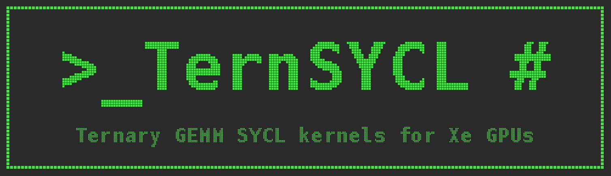

<p align="center">
  
</p>

# TernSYCL

Standalone SYCL kernels for ternary (2-bit, `{-1, 0, +1}` x per-group scale)
weight GEMM/GEMV on Intel Xe2 GPUs (Arc Pro B70 / BMG, Arc 140V / Lunar Lake).
TernSYCL is the SYCL counterpart of [TernOCL](https://github.com/libxsmm/TernOCL):
same kernels, data layouts, numerics, fused epilogues, drivers and benchmark
methodology, benchmarked against the TernOCL kernels on identical inputs.

| variant | math | activations | TernOCL counterpart |
| --- | --- | --- | --- |
| [int2_fp16_upcvt](int2_fp16_upcvt/) | int2 weights upconverted to fp16/bf16, fp16/bf16 DPAS, fp32 acc | fp16 or bf16 | `int2_fp16_upcvt.cl` |
| [int2_via_int2_x_int8_dpas](int2_via_int2_x_int8_dpas/) | activations quantized to int8 (per row and 128-group), native s8 x s2 DPAS, int32 acc | fp16 or bf16 | `int2_int8_dpas.cl` |
| [hadamard](hadamard/) | fused sign flip + blockwise 1024 Walsh-Hadamard input transform (Bonsai 2) | fp16 or bf16 | `hadamard_fwht.cl` |
| [bitcos_fp16_upcvt](bitcos_fp16_upcvt/) | BITCOS ternary weights (presence bitmap + compacted signs, `2 - z` bits/weight) decoded through an SLM table to fp16/bf16, fp16/bf16 DPAS, fp32 acc | fp16 or bf16 | `bitcos_fp16_upcvt.cl` |

The GEMM variants have a decode GEMV (M = 1..8) and a large-M GEMM (prefill),
and handle any M (ragged tiles are zero-filled on read and clipped on write).
They need `N % 16 == 0` and `K % 128 == 0`, with scale group size 128 (BITCOS
GEMV: `K % (64 * LS) == 0`).

## How the kernels are written

Plain SIMT SYCL (sub-group size 16). The Xe2 instructions are inline-vISA
helpers in [common/xe2.hpp](common/xe2.hpp), with no OpenCL or IGC builtins:

* DPAS: `dpas_hf` / `dpas_bf` (fp16 / bf16, K16) and `dpas_s2s8` (int2
  weights x int8 activations, K32); `mad8_at<BF16, ROW>` takes its 8-row A
  operand at GRF row `ROW` of a larger 2D read, aliased in place.
* 2D block I/O: `pl2d<shape>()` builds the address payload once per kernel,
  `pl2d_x` / `pl2d_y` move it per K step, and `rd2d<shape, DX, DY>()` reads
  at immediate block offsets (`lsc_load_block2d`), as IGC emits for its
  builtins. Explicit-surface forms (`rd_32b_8r16`, `wr_16b_8r16`, ...) cover
  the epilogue and the one-off reads.
* Sub-group block reads: `sg_rd_us{,4,8}`, `sg_rd_u4` (transposed
  `lsc_load ... d32xNt` from a uniform address).
* The int2 upcvt kernels build each DPAS B register from the XeTLA codes with
  predicated selects, as TernOCL: a SIMD32 `and.nz` on each lane's half-word
  (region `<2;2,0>`) against alternating bit masks gives the sign and nonzero
  predicates, then `(Ps) sel -s,+s` and `(~Pz) mov 0` (4 instructions per
  register instead of ~10; `make INT_DQ=1` builds XeTLA's integer decode).
  The large-M kernel reads A in 32-row x 32-K blocks (16 K for MT_M > 64)
  and issues the first K-step's A reads ahead of the B and scale reads, as
  TernOCL's schedule does (issuing them after the decode cost 3-6% at 64x32).
* The int8 large-M kernel quantizes A with XeTLA's instruction sequence as
  inline vISA, as in TernOCL; the BITCOS kernels apply the fp16 scale with
  XeTLA's two SIMD32 `hf` multiplies as inline vISA (`--int-apply` and
  `--simt-mul` select the alternatives, bf16 always uses the integer AND).
* 256 GRF (large-M kernels) via the `grf_size<256>` kernel property plus the
  AOT option `-ze-opt-large-register-file` (upcvt); the GEMV kernels request
  `grf_size<128>`. Required sub-group and work-group sizes via kernel
  properties.

Tile parameters are template parameters. Each driver compiles a table of tiles
(`--list-tiles`, one device image per kernel with
`-fsycl-device-code-split=per_kernel`) and picks one at run time, so a tile
sweep needs no rebuild, as with the OpenCL `-D` build. The fused epilogue is a
uniform kernel argument, except in the int8 large-M kernel, where it is a
template parameter (a runtime epilogue costs about 3% there).

An ESIMD version of the int8 large-M kernel was tried and was slower than the
SIMT one; it is not part of the repo.

## Layout

```
common/            xe2.hpp (inline-vISA DPAS / block I/O, 2D surfaces, dtype conversion), epilogue_dev.hpp (device
                   epilogues), epilogue.hpp / dt16.hpp (host epilogue, fp16/bf16, compare), driver.hpp
int2_fp16_upcvt/   kernels (int2_fp16_upcvt.hpp), driver, Makefile, validate.sh, bench.sh
int2_via_int2_x_int8_dpas/
                   kernels (int2_int8_dpas.hpp), driver, Makefile, validate.sh, bench.sh
hadamard/          kernel (hadamard_fwht.hpp), validating driver, Makefile
bitcos_fp16_upcvt/ kernels (bitcos_fp16_upcvt.hpp), driver, Makefile, validate.sh, bench.sh;
                   host packer in common/bitcos.hpp
run_all.sh         validate / epilogues / bench (vs TernOCL) for every variant, dtype and M
validate_epilogues.sh
```

## Build

Requirements: an Intel GPU driver with Level Zero (tested with the 26.35
runtime) and oneAPI 2026.0 (`icpx`).

```bash
unset LD_LIBRARY_PATH
source /swtools/intel-gpu/latest/intel_gpu_vars.sh
source /swtools/intel/2026.0/oneapi-vars.sh --force

make -C int2_fp16_upcvt              # AOT for AOT_DEVICES=bmg-g31,lnl-m (default)
make -C int2_via_int2_x_int8_dpas
make -C hadamard
make -C bitcos_fp16_upcvt
# make -C ... AOT_DEVICES=bmg-g21    # other devices; JIT=1 builds SPIR-V only

# TernOCL reference drivers (bench.sh compares against them)
git clone https://github.com/libxsmm/TernOCL.git
make -C TernOCL/int2_fp16_upcvt CXX=g++
make -C TernOCL/int2_via_int2_x_int8_dpas CXX=g++
make -C TernOCL/bitcos_fp16_upcvt CXX=g++
```

The kernels are compiled ahead of time (`-fsycl-targets=spir64_gen`). Use AOT
for benchmarking: with the JIT path (`JIT=1`), the bf16 kernels run slower and
switch between two speeds from process to process (e.g. 52 vs 72 us for the
27B down GEMV), and the slow state carries over to kernels loaded later in the
same process. The AOT binaries have bf16 = fp16 and are stable.

## Validate and benchmark

```bash
bash run_all.sh validate epilogues                             # all variants, fp16 + bf16
CARDS="0 1 2 3 4 5 6 7" DTYPES="fp16 bf16" bash run_all.sh bench # B70 node with 8 cards
PACE=15 DTYPES=fp16 bash run_all.sh bench                      # Lunar Lake
VARIANT=int2_fp16_upcvt DTYPES=bf16 MS=1 bash run_all.sh bench # one variant / dtype / M
```

`TERNOCL=` points to the TernOCL checkout (default `./TernOCL`). The
architecture (`b70` / `lnl`) comes from the hostname; set `ARCH=` to override
it. `CARDS=` spreads the shapes over several GPUs (`ZE_AFFINITY_MASK`, which
pins both the SYCL and the OpenCL driver). Results go to `<variant>/results/`
and are not tracked.

### Methodology

The same as TernOCL's:

* **Rotating weights:** enough distinct weight sets (B + scales) to exceed
  `--weights-gib` (default 2 GiB), with one untimed warm-up pass over every
  set, so every timed call streams its weights from DRAM.
* **Timing:** device profiling events. For the int8 variant, the time includes
  the activation-quantization pre-kernel.
* **Reported number:** for each shape, TernOCL and TernSYCL each pick their best
  tile from the same tile list (the sweep runs the two alternately on every
  tile); then the two winners are re-measured alternately 3 times on the same
  GPU and the median is reported.
* **Lunar Lake:** `PACE=15` sleeps before each re-measure, because
  shared-memory bandwidth drifts under sustained load. The unpaced sweep is
  then only a pre-filter: the 4 fastest tiles of each side (`TOPK`) are
  re-timed paced and the fastest is kept. Both drivers run on the same E-core
  (`PIN`, default `taskset -c 4` on LNL): each driver's host thread spins in
  the event wait, and on a P-core (up to ~4.5 GHz) it takes package power from
  the GPU once PL1 limits it (GPU at ~1.2 instead of ~1.85 GHz), by an amount
  that depends on the core the scheduler picked.

Shapes: Bonsai 8B (Qwen3-8B: qkv 4096x6144, o_proj 4096x4096, gate_up
4096x24576, down 12288x4096, lm_head 4096x151680) and Bonsai 27B (Qwen3.5-27B:
gate_up 5120x34816, down 17408x5120, in_proj_qkvz 5120x16384, out_proj
6144x5120, qkv 5120x14336, lm_head 5120x248320).

## Fused epilogues

The same post-ops as TernOCL, the XeTLA plugin and the OpenVINO integration,
selected with `--postop`:

| postop | epilogue |
| --- | --- |
| 0 | none |
| 1 | `silu(acc) * other` (SwiGLU gate) |
| 2 | `acc + other` (residual) |
| 3 | `acc + bias[n]` |
| 4 | `sigmoid(acc)` |

`--out-f32` writes fp32 C (and takes an fp32 bias), as for lm_head logits.
All post-ops work on the fp32 accumulator before the output cast, and sigmoid
matches `xetla_sigmoid`, including its clamp to 0 for `x <= -10`.

## Results (Arc Pro B70, fp16 activations)

TernOCL vs TernSYCL on the same card (AOT build, oneAPI 2026.0, GPU runtime
26.35). GEMV is M = 1, GEMM is M = 1024. SYCL/OCL > 1 means TernSYCL is
faster. The int8 times include the activation-quantization pre-kernel.

**int2_fp16_upcvt** (select decode, both sides; TernOCL `e08580c`)

| shape | K x N | GEMV OCL (us) | GEMV SYCL (us) | SYCL/OCL | GEMM OCL (ms) | GEMM SYCL (ms) | SYCL/OCL |
| --- | --- | ---: | ---: | ---: | ---: | ---: | ---: |
| 8B.qkv | 4096 x 6144 | 14.4 | 13.4 | x1.08 | 0.375 | 0.376 | x1.00 |
| 8B.o_proj | 4096 x 4096 | 10.4 | 9.7 | x1.07 | 0.257 | 0.256 | x1.01 |
| 8B.gate_up | 4096 x 24576 | 47.2 | 46.6 | x1.01 | 1.465 | 1.502 | x0.98 |
| 8B.down | 12288 x 4096 | 25.2 | 24.5 | x1.03 | 0.733 | 0.730 | x1.00 |
| 8B.lm_head | 4096 x 151680 | 278.6 | 278.0 | x1.00 | 9.598 | 9.625 | x1.00 |
| 27B.gate_up | 5120 x 34816 | 86.8 | 83.6 | x1.04 | 2.619 | 2.660 | x0.98 |
| 27B.down | 17408 x 5120 | 42.7 | 41.8 | x1.02 | 1.375 | 1.326 | x1.04 |
| 27B.qkvz | 5120 x 16384 | 40.1 | 39.3 | x1.02 | 1.261 | 1.250 | x1.01 |
| 27B.out_proj | 6144 x 5120 | 17.1 | 16.2 | x1.05 | 0.483 | 0.507 | x0.95 |
| 27B.qkv | 5120 x 14336 | 35.6 | 34.7 | x1.03 | 1.053 | 1.046 | x1.01 |
| 27B.lm_head | 5120 x 248320 | 571.3 | 572.3 | x1.00 | 20.170 | 20.187 | x1.00 |

27B.out_proj M=1024 is tile-sweep noise. On one card, alternating median of 3,
every tile lands at 0.50-0.52 ms for both, and SYCL/OCL is x0.97-x1.08 per tile.

**int2_via_int2_x_int8_dpas, qmode 0 (A quantized to int8 upfront)**

| shape | K x N | GEMV OCL (us) | GEMV SYCL (us) | SYCL/OCL | GEMM OCL (ms) | GEMM SYCL (ms) | SYCL/OCL |
| --- | --- | ---: | ---: | ---: | ---: | ---: | ---: |
| 8B.qkv | 4096 x 6144 | 15.4 | 14.2 | x1.09 | 0.257 | 0.251 | x1.02 |
| 8B.o_proj | 4096 x 4096 | 11.7 | 10.5 | x1.12 | 0.207 | 0.195 | x1.06 |
| 8B.gate_up | 4096 x 24576 | 48.5 | 47.4 | x1.02 | 0.926 | 0.905 | x1.02 |
| 8B.down | 12288 x 4096 | 26.6 | 25.4 | x1.04 | 0.547 | 0.503 | x1.09 |
| 8B.lm_head | 4096 x 151680 | 279.3 | 278.0 | x1.00 | 6.433 | 6.395 | x1.01 |
| 27B.gate_up | 5120 x 34816 | 82.8 | 82.0 | x1.01 | 1.733 | 1.685 | x1.03 |
| 27B.down | 17408 x 5120 | 43.5 | 42.4 | x1.02 | 0.917 | 0.885 | x1.04 |
| 27B.qkvz | 5120 x 16384 | 41.1 | 40.0 | x1.02 | 0.781 | 0.755 | x1.03 |
| 27B.out_proj | 6144 x 5120 | 18.3 | 17.0 | x1.07 | 0.329 | 0.318 | x1.03 |
| 27B.qkv | 5120 x 14336 | 36.5 | 35.4 | x1.03 | 0.713 | 0.706 | x1.01 |
| 27B.lm_head | 5120 x 248320 | 565.7 | 565.4 | x1.00 | 13.274 | 13.340 | x0.99 |

**int2_via_int2_x_int8_dpas, qmode 1 (A quantized in the GEMM, as XeTLA)**

| shape | K x N | GEMV OCL (us) | GEMV SYCL (us) | SYCL/OCL | GEMM OCL (ms) | GEMM SYCL (ms) | SYCL/OCL |
| --- | --- | ---: | ---: | ---: | ---: | ---: | ---: |
| 8B.qkv | 4096 x 6144 | 15.2 | 14.1 | x1.08 | 0.303 | 0.294 | x1.03 |
| 8B.o_proj | 4096 x 4096 | 11.5 | 10.4 | x1.11 | 0.221 | 0.223 | x0.99 |
| 8B.gate_up | 4096 x 24576 | 48.3 | 47.3 | x1.02 | 1.100 | 1.101 | x1.00 |
| 8B.down | 12288 x 4096 | 26.5 | 25.2 | x1.05 | 0.612 | 0.577 | x1.06 |
| 8B.lm_head | 4096 x 151680 | 278.7 | 278.1 | x1.00 | 6.850 | 6.883 | x0.99 |
| 27B.gate_up | 5120 x 34816 | 83.1 | 82.1 | x1.01 | 1.915 | 1.940 | x0.99 |
| 27B.down | 17408 x 5120 | 43.2 | 42.2 | x1.02 | 1.061 | 0.997 | x1.06 |
| 27B.qkvz | 5120 x 16384 | 40.9 | 40.0 | x1.02 | 0.894 | 0.899 | x0.99 |
| 27B.out_proj | 6144 x 5120 | 18.2 | 16.9 | x1.08 | 0.378 | 0.371 | x1.02 |
| 27B.qkv | 5120 x 14336 | 36.3 | 35.4 | x1.03 | 0.859 | 0.854 | x1.01 |
| 27B.lm_head | 5120 x 248320 | 566.1 | 565.4 | x1.00 | 14.837 | 14.909 | x0.99 |

**bitcos_fp16_upcvt** (Bonsai 2 27B shapes, zero density 0.40, fp16;
`bitcos_fp16_upcvt/validate.sh`: 72/72, `bench.sh`)

| shape | K x N | GEMV OCL (us) | GEMV SYCL (us) | SYCL/OCL | GEMM OCL (ms) | GEMM SYCL (ms) | SYCL/OCL |
| --- | --- | ---: | ---: | ---: | ---: | ---: | ---: |
| 27B.gate_up | 5120 x 34816 | 105.3 | 103.4 | x1.02 | 4.93 | 5.35 | x0.92 |
| 27B.down | 17408 x 5120 | 53.3 | 58.5 | x0.91 | 2.52 | 2.60 | x0.97 |
| 27B.qkvz | 5120 x 16384 | 49.4 | 48.5 | x1.02 | 2.35 | 2.45 | x0.96 |
| 27B.out_proj | 6144 x 5120 | 22.2 | 22.6 | x0.98 | 0.89 | 0.93 | x0.96 |
| 27B.qkv | 5120 x 14336 | 44.3 | 42.9 | x1.03 | 1.96 | 2.06 | x0.95 |
| 27B.lm_head | 5120 x 248320 | 607 | 614 | x0.99 | 35.1 | 38.7 | x0.91 |

## Results (Arc 140V / Lunar Lake, fp16 activations)

Same build and methodology, `PACE=15`, both drivers pinned to E-core 4.

**int2_fp16_upcvt**

| shape | K x N | GEMV OCL (us) | GEMV SYCL (us) | SYCL/OCL | GEMM OCL (ms) | GEMM SYCL (ms) | SYCL/OCL |
| --- | --- | ---: | ---: | ---: | ---: | ---: | ---: |
| 8B.qkv | 4096 x 6144 | 93.3 | 95.8 | x0.97 | 2.154 | 2.116 | x1.02 |
| 8B.o_proj | 4096 x 4096 | 65.9 | 67.3 | x0.98 | 1.455 | 1.523 | x0.95 |
| 8B.gate_up | 4096 x 24576 | 303.6 | 303.2 | x1.00 | 8.824 | 8.329 | x1.06 |
| 8B.down | 12288 x 4096 | 155.7 | 156.8 | x0.99 | 4.991 | 5.236 | x0.95 |
| 8B.lm_head | 4096 x 151680 | 1861.7 | 1851.2 | x1.01 | 50.011 | 52.594 | x0.95 |
| 27B.gate_up | 5120 x 34816 | 540.3 | 543.0 | x0.99 | 15.009 | 14.434 | x1.04 |
| 27B.down | 17408 x 5120 | 272.3 | 273.2 | x1.00 | 8.186 | 7.942 | x1.03 |
| 27B.qkvz | 5120 x 16384 | 254.0 | 254.2 | x1.00 | 7.352 | 7.368 | x1.00 |
| 27B.out_proj | 6144 x 5120 | 116.4 | 113.7 | x1.02 | 2.858 | 2.827 | x1.01 |
| 27B.qkv | 5120 x 14336 | 226.6 | 228.0 | x0.99 | 6.272 | 6.103 | x1.03 |
| 27B.lm_head | 5120 x 248320 | 3766.8 | 3759.0 | x1.00 | 115.969 | 115.416 | x1.00 |

The LNL upcvt numbers predate the select decode.

## Results (Arc B580, fp16 activations)

TernSYCL only (TernOCL was not built here), with the same tile lists and methodology as `bench.sh`: best tile per shape
from the sweep, then the median of 3 re-measures; 2 GiB rotating weights, 20 iterations. AOT build for bmg-g21, oneAPI
2025.3.3, Level Zero driver 1.17.39758, main at 42a1cec. GEMV is M = 1, GEMM is M = 1024. The int8 times include the
activation-quantization pre-kernel. The GEMVs run at the B580's memory bandwidth (456 GB/s rated): 27B.lm_head M = 1
streams its 338 MB of weights and scales in ~748 us (~450 GB/s).

**int2_fp16_upcvt**

| shape | K x N | GEMV SYCL (us) | GEMM SYCL (ms) |
| --- | --- | ---: | ---: |
| 8B.qkv | 4096 x 6144 | 18.1 | 0.556 |
| 8B.o_proj | 4096 x 4096 | 12.1 | 0.380 |
| 8B.gate_up | 4096 x 24576 | 66.4 | 2.217 |
| 8B.down | 12288 x 4096 | 32.8 | 1.125 |
| 8B.lm_head | 4096 x 151680 | 369.6 | 13.627 |
| 27B.gate_up | 5120 x 34816 | 108.1 | 3.872 |
| 27B.down | 17408 x 5120 | 56.7 | 1.845 |
| 27B.qkvz | 5120 x 16384 | 52.5 | 1.782 |
| 27B.out_proj | 6144 x 5120 | 21.0 | 0.669 |
| 27B.qkv | 5120 x 14336 | 46.3 | 1.576 |
| 27B.lm_head | 5120 x 248320 | 750.9 | 27.427 |

**int2_via_int2_x_int8_dpas, qmode 0 (A quantized to int8 upfront)**

| shape | K x N | GEMV SYCL (us) | GEMM SYCL (ms) |
| --- | --- | ---: | ---: |
| 8B.qkv | 4096 x 6144 | 17.9 | 0.349 |
| 8B.o_proj | 4096 x 4096 | 12.7 | 0.240 |
| 8B.gate_up | 4096 x 24576 | 64.7 | 1.395 |
| 8B.down | 12288 x 4096 | 32.9 | 0.794 |
| 8B.lm_head | 4096 x 151680 | 368.2 | 9.139 |
| 27B.gate_up | 5120 x 34816 | 108.4 | 2.640 |
| 27B.down | 17408 x 5120 | 56.0 | 1.305 |
| 27B.qkvz | 5120 x 16384 | 52.9 | 1.177 |
| 27B.out_proj | 6144 x 5120 | 21.5 | 0.450 |
| 27B.qkv | 5120 x 14336 | 46.4 | 1.004 |
| 27B.lm_head | 5120 x 248320 | 747.7 | 18.629 |

**int2_via_int2_x_int8_dpas, qmode 1 (A quantized in the GEMM, as XeTLA)**

| shape | K x N | GEMV SYCL (us) | GEMM SYCL (ms) |
| --- | --- | ---: | ---: |
| 8B.qkv | 4096 x 6144 | 17.8 | 0.408 |
| 8B.o_proj | 4096 x 4096 | 12.7 | 0.287 |
| 8B.gate_up | 4096 x 24576 | 64.8 | 1.580 |
| 8B.down | 12288 x 4096 | 32.8 | 0.876 |
| 8B.lm_head | 4096 x 151680 | 368.6 | 10.093 |
| 27B.gate_up | 5120 x 34816 | 108.2 | 2.888 |
| 27B.down | 17408 x 5120 | 56.1 | 1.495 |
| 27B.qkvz | 5120 x 16384 | 52.7 | 1.327 |
| 27B.out_proj | 6144 x 5120 | 21.5 | 0.518 |
| 27B.qkv | 5120 x 14336 | 46.6 | 1.157 |
| 27B.lm_head | 5120 x 248320 | 747.6 | 20.898 |

**bitcos_fp16_upcvt** (Bonsai 2 27B shapes, zero density 0.40)

| shape | K x N | GEMV SYCL (us) | GEMM SYCL (ms) |
| --- | --- | ---: | ---: |
| 27B.gate_up | 5120 x 34816 | 154.0 | 6.76 |
| 27B.down | 17408 x 5120 | 79.1 | 3.48 |
| 27B.qkvz | 5120 x 16384 | 77.2 | 3.21 |
| 27B.out_proj | 6144 x 5120 | 29.8 | 1.21 |
| 27B.qkv | 5120 x 14336 | 65.9 | 2.77 |
| 27B.lm_head | 5120 x 248320 | 980.4 | 47.58 |

## Current vs previous main (B70, fp16)

This tree (inline vISA + int2 select decode) vs main at 5e162d8 (IGC
builtins, integer decode), same card, each with its best tile from the same
sweep, alternating runs, median of 3. Speed = 5e162d8 time / current time.

**int2_fp16_upcvt**

| shape | M=1 5e162d8 (us) | M=1 now (us) | speed | M=1024 5e162d8 (ms) | M=1024 now (ms) | speed |
| --- | ---: | ---: | ---: | ---: | ---: | ---: |
| 8B.qkv | 16.6 | 13.3 | x1.24 | 0.457 | 0.384 | x1.19 |
| 8B.o_proj | 12.0 | 9.7 | x1.24 | 0.307 | 0.258 | x1.19 |
| 8B.gate_up | 57.2 | 47.4 | x1.21 | 1.846 | 1.537 | x1.20 |
| 8B.down | 28.9 | 24.5 | x1.18 | 0.901 | 0.724 | x1.24 |
| 8B.lm_head | 348.8 | 279.2 | x1.25 | 12.106 | 9.835 | x1.23 |
| 27B.gate_up | 107.1 | 83.8 | x1.28 | 3.293 | 2.644 | x1.25 |
| 27B.down | 52.1 | 41.9 | x1.24 | 1.800 | 1.331 | x1.35 |
| 27B.qkvz | 46.0 | 39.4 | x1.17 | 1.507 | 1.249 | x1.21 |
| 27B.out_proj | 20.5 | 16.2 | x1.26 | 0.636 | 0.493 | x1.29 |
| 27B.qkv | 41.8 | 34.9 | x1.20 | 1.299 | 1.057 | x1.23 |
| 27B.lm_head | 705.1 | 569.3 | x1.24 | 25.387 | 20.990 | x1.21 |

**int2_via_int2_x_int8_dpas** (M=1 is at the bandwidth limit for both: x0.98-x1.00)

| shape | M=1024 qm0 5e162d8 (ms) | M=1024 qm0 now (ms) | speed | M=1024 qm1 5e162d8 (ms) | M=1024 qm1 now (ms) | speed |
| --- | ---: | ---: | ---: | ---: | ---: | ---: |
| 8B.qkv | 0.240 | 0.233 | x1.03 | 0.295 | 0.299 | x0.99 |
| 8B.o_proj | 0.174 | 0.167 | x1.04 | 0.200 | 0.207 | x0.97 |
| 8B.gate_up | 0.941 | 0.864 | x1.09 | 1.152 | 1.151 | x1.00 |
| 8B.down | 0.510 | 0.464 | x1.10 | 0.585 | 0.576 | x1.02 |
| 8B.lm_head | 6.436 | 5.491 | x1.17 | 7.082 | 7.107 | x1.00 |
| 27B.gate_up | 1.673 | 1.532 | x1.09 | 1.926 | 1.926 | x1.00 |
| 27B.down | 0.873 | 0.814 | x1.07 | 1.020 | 1.005 | x1.01 |
| 27B.qkvz | 0.753 | 0.730 | x1.03 | 0.909 | 0.907 | x1.00 |
| 27B.out_proj | 0.309 | 0.291 | x1.06 | 0.360 | 0.367 | x0.98 |
| 27B.qkv | 0.649 | 0.593 | x1.09 | 0.789 | 0.783 | x1.01 |
| 27B.lm_head | 13.606 | 12.108 | x1.12 | 15.601 | 15.568 | x1.00 |

## Inline vISA vs IGC builtins (before / after)

The kernels first used the OpenCL / IGC builtins (`intel_sub_group_*`,
`__builtin_IB_*`); they now use the inline-vISA helpers above. Per shape,
builtins (commit 5e162d8) vs inline vISA, both on the same tile (the best of
the tiles the benches picked), alternating runs of the two binaries: B70 median
of 5, LNL median of 3 with both pinned to E-core 4 (`taskset -c 4`) and 5 s
between runs. Speed = builtins time / vISA time (> 1: vISA faster). BITCOS
covers the 27B shapes. On tiny kernels the second binary of a pair is ~2%
faster (8B.qkv M=1 on B70 is x1.02 with the order reversed).

B70, upcvt:

| shape | M=1 builtins (us) | M=1 vISA (us) | M=1 speed | M=1024 builtins (ms) | M=1024 vISA (ms) | M=1024 speed |
|---|---|---|---|---|---|---|
| 8B.qkv | 16.6 | 17.1 | x0.97 | 0.461 | 0.464 | x0.99 |
| 8B.o_proj | 12.0 | 12.1 | x1.00 | 0.320 | 0.314 | x1.02 |
| 8B.gate_up | 57.3 | 57.3 | x1.00 | 1.853 | 1.849 | x1.00 |
| 8B.down | 29.0 | 29.2 | x0.99 | 0.877 | 0.876 | x1.00 |
| 8B.lm_head | 350.6 | 349.5 | x1.00 | 11.896 | 11.716 | x1.02 |
| 27B.gate_up | 105.5 | 105.8 | x1.00 | 3.264 | 3.278 | x1.00 |
| 27B.down | 52.6 | 52.8 | x0.99 | 1.800 | 1.833 | x0.98 |
| 27B.qkvz | 46.2 | 45.8 | x1.01 | 1.486 | 1.489 | x1.00 |
| 27B.out_proj | 20.1 | 20.3 | x0.99 | 0.661 | 0.661 | x1.00 |
| 27B.qkv | 41.8 | 40.8 | x1.02 | 1.291 | 1.316 | x0.98 |
| 27B.lm_head | 705.4 | 707.6 | x1.00 | 25.014 | 25.018 | x1.00 |

B70, int8:

| shape | qmode | M=1 builtins (us) | M=1 vISA (us) | M=1 speed | M=1024 builtins (ms) | M=1024 vISA (ms) | M=1024 speed |
|---|---|---|---|---|---|---|---|
| 8B.qkv | 0 | 14.1 | 14.2 | x1.00 | 0.239 | 0.234 | x1.02 |
| 8B.qkv | 1 | 14.1 | 14.1 | x1.00 | 0.293 | 0.294 | x1.00 |
| 8B.o_proj | 0 | 10.4 | 10.4 | x1.00 | 0.179 | 0.173 | x1.03 |
| 8B.o_proj | 1 | 10.4 | 10.4 | x1.00 | 0.203 | 0.202 | x1.00 |
| 8B.gate_up | 0 | 47.5 | 47.5 | x1.00 | 0.923 | 0.857 | x1.08 |
| 8B.gate_up | 1 | 47.4 | 47.5 | x1.00 | 1.121 | 1.109 | x1.01 |
| 8B.down | 0 | 25.3 | 25.3 | x1.00 | 0.512 | 0.462 | x1.11 |
| 8B.down | 1 | 25.2 | 25.2 | x1.00 | 0.588 | 0.585 | x1.00 |
| 8B.lm_head | 0 | 278.1 | 278.4 | x1.00 | 6.468 | 5.693 | x1.14 |
| 8B.lm_head | 1 | 278.1 | 278.6 | x1.00 | 7.140 | 7.101 | x1.01 |
| 27B.gate_up | 0 | 82.1 | 82.7 | x0.99 | 1.650 | 1.527 | x1.08 |
| 27B.gate_up | 1 | 82.5 | 82.9 | x1.00 | 2.014 | 1.999 | x1.01 |
| 27B.down | 0 | 42.4 | 42.6 | x1.00 | 0.875 | 0.818 | x1.07 |
| 27B.down | 1 | 42.3 | 42.3 | x1.00 | 1.032 | 1.019 | x1.01 |
| 27B.qkvz | 0 | 40.0 | 40.0 | x1.00 | 0.760 | 0.727 | x1.04 |
| 27B.qkvz | 1 | 40.0 | 40.0 | x1.00 | 0.917 | 0.918 | x1.00 |
| 27B.out_proj | 0 | 16.9 | 17.2 | x0.98 | 0.307 | 0.287 | x1.07 |
| 27B.out_proj | 1 | 16.8 | 17.2 | x0.98 | 0.368 | 0.369 | x1.00 |
| 27B.qkv | 0 | 35.4 | 35.5 | x1.00 | 0.662 | 0.622 | x1.06 |
| 27B.qkv | 1 | 35.4 | 35.4 | x1.00 | 0.822 | 0.814 | x1.01 |
| 27B.lm_head | 0 | 565.5 | 566.9 | x1.00 | 13.250 | 11.816 | x1.12 |
| 27B.lm_head | 1 | 565.6 | 567.5 | x1.00 | 15.366 | 15.382 | x1.00 |

B70, BITCOS:

| shape | M=1 builtins (us) | M=1 vISA (us) | M=1 speed | M=1024 builtins (ms) | M=1024 vISA (ms) | M=1024 speed |
|---|---|---|---|---|---|---|
| 27B.gate_up | 100.2 | 100.3 | x1.00 | 5.142 | 5.100 | x1.01 |
| 27B.down | 57.2 | 53.6 | x1.07 | 2.411 | 2.314 | x1.04 |
| 27B.qkvz | 49.1 | 48.6 | x1.01 | 2.337 | 2.273 | x1.03 |
| 27B.out_proj | 22.4 | 21.5 | x1.04 | 0.854 | 0.829 | x1.03 |
| 27B.qkv | 42.9 | 42.1 | x1.02 | 1.894 | 1.815 | x1.04 |
| 27B.lm_head | 625.2 | 623.8 | x1.00 | 38.640 | 37.159 | x1.04 |

LNL, upcvt:

| shape | M=1 builtins (us) | M=1 vISA (us) | M=1 speed | M=1024 builtins (ms) | M=1024 vISA (ms) | M=1024 speed |
|---|---|---|---|---|---|---|
| 8B.qkv | 211.9 | 209.6 | x1.01 | 2.217 | 2.127 | x1.04 |
| 8B.o_proj | 138.4 | 139.3 | x0.99 | 1.435 | 1.436 | x1.00 |
| 8B.gate_up | 302.7 | 302.1 | x1.00 | 8.244 | 8.270 | x1.00 |
| 8B.down | 155.1 | 154.5 | x1.00 | 4.864 | 5.004 | x0.97 |
| 8B.lm_head | 1849.6 | 1849.2 | x1.00 | 52.841 | 53.103 | x1.00 |
| 27B.gate_up | 544.2 | 540.0 | x1.01 | 14.362 | 14.433 | x1.00 |
| 27B.down | 273.0 | 272.9 | x1.00 | 7.853 | 7.984 | x0.98 |
| 27B.qkvz | 254.3 | 253.6 | x1.00 | 7.109 | 7.178 | x0.99 |
| 27B.out_proj | 109.4 | 104.1 | x1.05 | 2.798 | 2.851 | x0.98 |
| 27B.qkv | 229.3 | 227.9 | x1.01 | 6.074 | 6.106 | x0.99 |
| 27B.lm_head | 3752.5 | 3751.0 | x1.00 | 121.221 | 122.518 | x0.99 |

LNL, int8:

| shape | qmode | M=1 builtins (us) | M=1 vISA (us) | M=1 speed | M=1024 builtins (ms) | M=1024 vISA (ms) | M=1024 speed |
|---|---|---|---|---|---|---|---|
| 8B.qkv | 0 | 66.0 | 66.1 | x1.00 | 1.153 | 1.092 | x1.06 |
| 8B.qkv | 1 | 66.8 | 66.7 | x1.00 | 1.367 | 1.368 | x1.00 |
| 8B.o_proj | 0 | 46.8 | 46.8 | x1.00 | 0.774 | 0.779 | x0.99 |
| 8B.o_proj | 1 | 48.2 | 48.3 | x1.00 | 0.940 | 0.939 | x1.00 |
| 8B.gate_up | 0 | 255.8 | 254.7 | x1.00 | 4.779 | 4.543 | x1.05 |
| 8B.gate_up | 1 | 255.8 | 254.2 | x1.01 | 5.237 | 5.240 | x1.00 |
| 8B.down | 0 | 131.5 | 132.2 | x0.99 | 2.597 | 2.617 | x0.99 |
| 8B.down | 1 | 132.9 | 132.9 | x1.00 | 3.013 | 3.012 | x1.00 |
| 8B.lm_head | 0 | 1554.8 | 1552.1 | x1.00 | 28.325 | 25.540 | x1.11 |
| 8B.lm_head | 1 | 1554.6 | 1553.5 | x1.00 | 30.727 | 30.720 | x1.00 |
| 27B.gate_up | 0 | 447.1 | 446.5 | x1.00 | 8.231 | 7.795 | x1.06 |
| 27B.gate_up | 1 | 448.1 | 446.0 | x1.00 | 9.114 | 9.116 | x1.00 |
| 27B.down | 0 | 226.1 | 225.4 | x1.00 | 4.477 | 4.528 | x0.99 |
| 27B.down | 1 | 226.0 | 226.2 | x1.00 | 5.051 | 5.061 | x1.00 |
| 27B.qkvz | 0 | 231.2 | 229.6 | x1.01 | 4.176 | 3.767 | x1.11 |
| 27B.qkvz | 1 | 232.7 | 231.6 | x1.00 | 4.493 | 4.494 | x1.00 |
| 27B.out_proj | 0 | 82.4 | 83.1 | x0.99 | 1.540 | 1.430 | x1.08 |
| 27B.out_proj | 1 | 83.2 | 83.8 | x0.99 | 1.763 | 1.760 | x1.00 |
| 27B.qkv | 0 | 186.8 | 185.6 | x1.01 | 3.480 | 3.297 | x1.06 |
| 27B.qkv | 1 | 187.2 | 187.8 | x1.00 | 3.833 | 3.831 | x1.00 |
| 27B.lm_head | 0 | 3173.6 | 3171.8 | x1.00 | 57.357 | 51.909 | x1.10 |
| 27B.lm_head | 1 | 3171.2 | 3169.9 | x1.00 | 64.083 | 64.094 | x1.00 |

LNL, BITCOS:

| shape | M=1 builtins (us) | M=1 vISA (us) | M=1 speed | M=1024 builtins (ms) | M=1024 vISA (ms) | M=1024 speed |
|---|---|---|---|---|---|---|
| 27B.gate_up | 560.4 | 557.5 | x1.01 | 23.634 | 21.894 | x1.08 |
| 27B.down | 331.6 | 336.0 | x0.99 | 12.019 | 11.620 | x1.03 |
| 27B.qkvz | 271.7 | 268.6 | x1.01 | 11.119 | 10.951 | x1.02 |
| 27B.out_proj | 122.7 | 122.6 | x1.00 | 4.051 | 3.889 | x1.04 |
| 27B.qkv | 267.5 | 267.5 | x1.00 | 9.608 | 9.307 | x1.03 |
| 27B.lm_head | 3567.1 | 3539.6 | x1.01 | 165.937 | 163.285 | x1.02 |

## SYCL codegen notes

* **Inline vISA:** works in SIMT SYCL. Guard the `asm` with
  `__SYCL_DEVICE_ONLY__`, because the host pass rejects the `rw` constraint.
  IGC does not reorder the asm, so it has to match what IGC emits for its
  builtins, or it is slower:
  * Uniform scalars (2D surface fields, coordinates) take `rw.u`; per-lane
    `rw` broadcasts them to 16 lanes. A send address is copied into a
    GRF-aligned `.decl` temp (a `rw.u` scalar may sit mid-register).
  * Immediates (2D block offsets) are spliced into the asm text at compile
    time (`asm((constexpr string))`); the `i` constraint emits `0x0:d` and
    `%c` drops the asm.
  * Results smaller than a GRF (16x1 d16 2D reads, `d32x8t`) go through a
    GRF temp: the load writes the whole register.
  * Build each 2D payload once and update x / y per K step. Rebuilding it per
    load costs ~6 `mov`s each and makes the payloads share one register,
    which serializes the loads.
  * Loads issue in source order: put the latency-critical ones first (the
    int8 large-M A block before B and the scales).
  * `group_load` lowers vector sub-group reads to per-lane gathers; use the
    transposed LSC load.
  * LLVM treats asm as cheap: `#pragma unroll 1` on the K loops, an
    `if constexpr` remainder loop, and a fold over the row blocks in the
    epilogue (a partial unroll left the accumulators in memory).
* **`-foffload-fp32-prec-div`:** with it, IGC's vectorizer miscompiles the
  uniform `native::recip(group_broadcast(x, r))` (rows 1..7 are dropped).
  Without it, `native::recip` is `math.inv` and the kernels validate.
* **`.lo` / `.hi` of a 2-block 2D read:** splitting the `ushort16` result of an
  `8r16x2` read with `.lo` / `.hi` plus `__builtin_bit_cast` gives wrong data;
  copy element by element.
* **Runtime epilogue:** in the int8 large-M kernel, a runtime-selected epilogue
  changes the register allocation of the K loop and costs ~3%.
* **256 GRF:** the `grf_size<256>` property alone gives IGC
  `-HWThreadNumberPerEU 4` but not `-TotalGRFNum 256`. The upcvt 128x16
  large-M K loop then rotates the A tiles through ~7 registers (167 `sync` vs
  16 in the OpenCL build) and is 10-17% slower. Linking with
  `-Xs "-options -ze-opt-large-register-file"` restores the OpenCL schedule;
  it applies to every kernel, so the GEMV kernels request `grf_size<128>`.
* **Vector conversions:** convert int32 accumulators with
  `__builtin_convertvector(acc, float8)`. Per-element casts made IGC use one
  scratch register for every conversion, which stalled each following `mad`.
* **Issue loads first:** in the int8 large-M kernel, all scale loads are issued
  into registers before any is converted. Converting bf16 as each load arrived
  (`shl` through `acc0`) made IGC reuse one register for all of them and
  serialize the loads.
* **Scheduling sensitivity:** SIMT codegen in IGC is sensitive to small source
  changes (instruction order, temporaries, vector types). Inline vISA fixes the
  instructions, but not their final schedule or register allocation. Other
  forms of the in-GEMM quantization (per-row temporaries, one interleaved
  8x128 vISA block), B prefetch and an ESIMD kernel were all slower.
* **bf16, qmode 1:** the int8 large-M kernel with in-GEMM quantization and bf16
  activations is ~7% slower than TernOCL on the 27B gate_up shape (2.05 vs
  1.91 ms); fp16 is on par.
* **BITCOS gaps:** the GEMV inner loop matches TernOCL's (214 vs 213
  instructions per 64 k, same 32 SIMD32 `hf` multiplies and 4 DPAS), but IGC
  issues the A load after the first use of the sign gather, where the OpenCL
  build issues it before. On narrow-N, long-K shapes with LS = 2 the latency is
  exposed (down / out_proj ~20% slower at that tile, 9% at the best one). The
  M-tiled loop carries ~50 more scalar and integer instructions than OpenCL's
  (336 vs 286 at 64x16). A-ahead prefetch, a software-pipelined loop, 32-bit
  offsets and allocation alignment did not close either gap.

## License

BSD 3-Clause, see [LICENSE.md](LICENSE.md) and [NOTICE](NOTICE).
